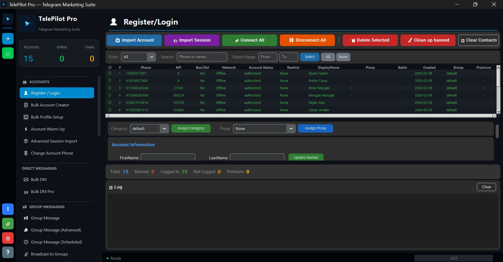

# Telegram Member Adder v1.0

Consent-based community onboarding software for Telegram groups and channels you own or administer.

## Preview

## Features

- Member onboarding workflows for owned or administered communities
- Contact review and eligibility checks before invitation
- Scheduling controls for organized onboarding campaigns
- Duplicate detection and activity tracking
- Operator workspace for authorized team accounts
- Commercial license activation and support

## Download

Latest version: 1.0.0

[Download Telegram-Member-Adder-1.0.0.exe](https://github.com/anoop14613742/telegram-member-adder/releases/download/v1.0.0/Telegram-Member-Adder-1.0.0.exe)

System requirements:

- Windows 10 or newer
- 2 GB RAM
- 500 MB disk space
- Internet connection

## Quick Start

1. Download the executable.
2. Run `Telegram-Member-Adder-1.0.0.exe`.
3. Enter your license key from [telepilotpro.com](https://telepilotpro.com).
4. Load only contacts and communities you are authorized to manage.
5. Review onboarding settings and start the workflow.

## Responsible Use

Use this tool only for consent-based onboarding and legitimate community administration. Do not use it for unsolicited invites, spam, harassment, scraping, or platform evasion.

## Documentation

- [Setup Guide](https://telepilotpro.com/docs/telegram-member-adder/getting-started)
- [Advanced Features](https://telepilotpro.com/docs/telegram-member-adder/features)
- [Troubleshooting](https://telepilotpro.com/docs/troubleshooting)

## Support

- Email: support@telepilotpro.com
- Telegram: [@TelePilotPro](https://t.me/TelePilotPro)

## Pricing

Telegram Member Adder is commercial software with flexible licensing plans.

[Notify me](https://telepilotpro.com/telegram-member-adder)

## License

Commercial Software - see [LICENSE](./LICENSE).

Copyright (c) 2026 TelePilot Pro.
